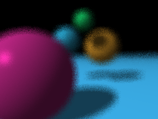

Xianguang Yan
CPE 473 Final Project
Depth of Field
============

This is my final project for Depth of Field where I implement depth of field. Depth of field is an effect that allows the users to focus on the object and have the other objects in the background blurred. It is most notibly used in photography.

Here is a sample of my Depth of Field at 200
--------------------------------------

As you can see, it looks almost completely normal, but do not be fooled! Muahaha!

Here is a Depth of Field at 6
-------------------------------

As you can see, this looks different. The blue one is more visible and the ones in the back are much more blurred. The super sampling in this is set at 4, but if one were to set it to 64 it would look much more better. However, I did not have the patients to sit that long.

Here is Another Example Field at 14
------------------------------------

Here is another with the camera moved to the pink ball and a depth of field set to 14.

Software Software Everyone Improve your Software
-----------------------------------------------

I wrote pretty disgusting code for the most part, but I wanted to point out near the end of my raytracer. I improved a lot on my refractoring and code efficentcy. If you look at the commits from the more recent ones it is much more concise and does not do a ton of round about coding. I also broke apart the normalization function as that function has caused me a ton of grief. It was the rason why my montecarlo wasn't working.

Thanks for visiting!

